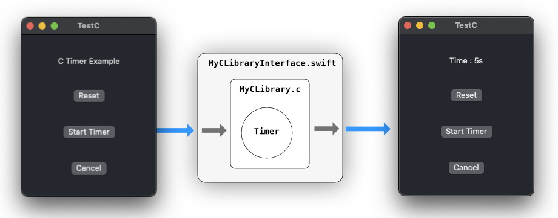

# C callback to Swift
**An example of interaction between C code and Swift**

This example changes a value of a C String in a C Library and displays it in a field in a SwiftUI view.

## Author

Tristan Leblanc <tristan@moosefactory.eu>

***

